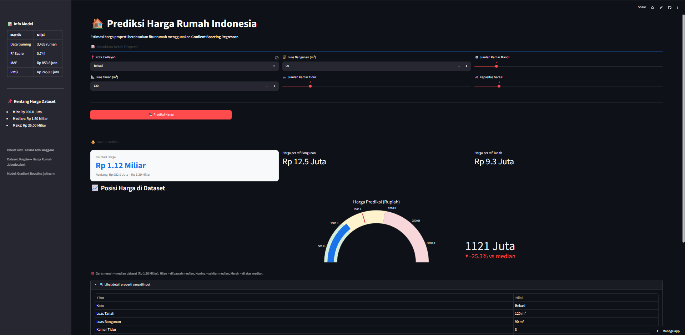
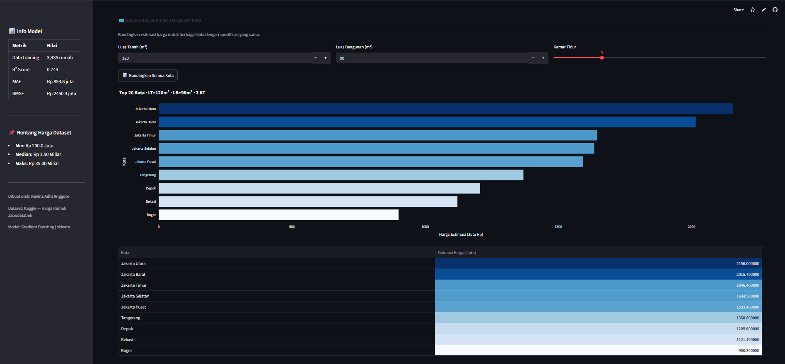

# 🏠 Indonesia House Price Prediction

An interactive web app for predicting house prices in Indonesia (Jabodetabek area) using Machine Learning, built with **Streamlit** and **Gradient Boosting Regressor**.

## 📁 Project Structure

```
house-price-app/
├── data/
│   └── house_prices.csv      # place your dataset CSV here
├── model/                   # auto-generated after training
│   ├── pipeline.pkl
│   ├── kota_list.pkl
│   └── metadata.pkl
├── train_model.py           # model training script
├── app.py                   # Streamlit application
├── requirements.txt
└── README.md
```

## 🚀 Getting Started

### 1. Install dependencies
```bash
pip install -r requirements.txt
```

### 2. Prepare the dataset
Dataset used: [Jabodetabek House Price](https://www.kaggle.com/datasets/nafisbarizki/daftar-harga-rumah-jabodetabek), save it as `data/harga_rumah.csv`

**Important:** Open `train_model.py` and adjust `COLUMN_MAP` to match your dataset's column names if they differ.

### 3. Train the model
```bash
python train_model.py
```
This generates `model/pipeline.pkl` and prints evaluation metrics (MAE, RMSE, R²).

### 4. Run the application
```bash
streamlit run app.py
```
Open your browser at `http://localhost:8501`

## 🌐 Free Deployment to Streamlit Cloud

1. Push this project folder to GitHub (including the `model/` folder with `.pkl` files)
2. Go to [share.streamlit.io](https://share.streamlit.io)
3. Log in with GitHub, select this repo, set the main file to `app.py`
4. Click Deploy — the link can be shared directly with recruiters!

## 🛠️ Tech Stack

- **Model:** Gradient Boosting Regressor (scikit-learn)
- **Preprocessing:** StandardScaler + OneHotEncoder via sklearn Pipeline
- **Visualization:** Plotly (gauge chart, city comparison bar chart)
- **Frontend:** Streamlit

## 📊 App Features

- Interactive inputs: city, land/building size, bedrooms/bathrooms, garage
- Real-time price prediction with estimated range
- Gauge chart showing price position relative to the dataset median
- City-to-city price comparison simulation with matching house specs
- Sidebar with model performance summary (R², MAE, RMSE)

## 💡 Insight & Business Value

The model achieves an R² of 0.74, meaning a substantial portion of house price variation in the Jabodetabek area can be explained by land size, building size, number of rooms, and location. City/location proved to be one of the strongest price drivers, mirroring real-world property trends where prime locations (e.g. South Jakarta) consistently command higher prices than surrounding suburban areas.

This tool can help property agents or prospective buyers get a fair price estimate before negotiation, and compare potential property prices across different cities given the same specifications.

## 📸 Demo

[🔗 Access Live Demo Application Here](https://kevinz-house-price-jabodetabek.streamlit.app/)

### Main Dashboard View


### Exploration Simulation per City


## 👤 Author

**Kevinz Adhi Anggoro**
Data Science Bootcamp Graduate Batch 56 — Digital Skola
